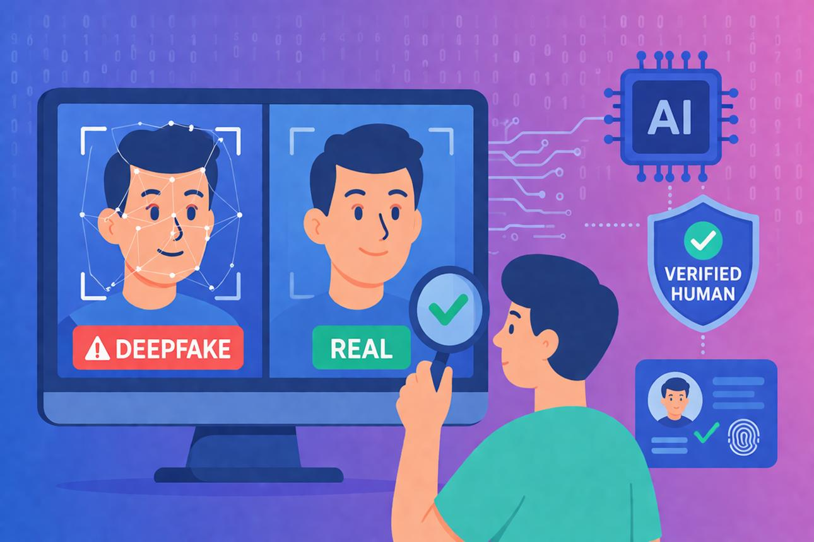
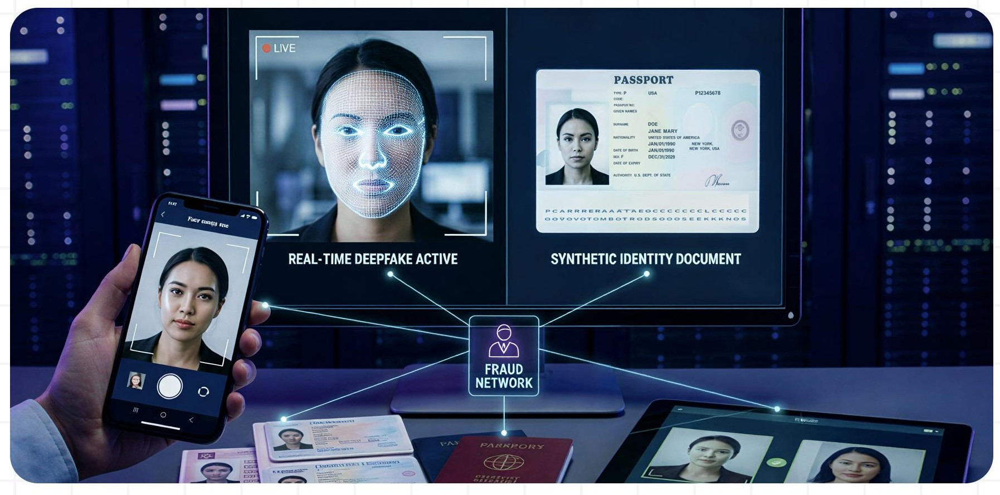
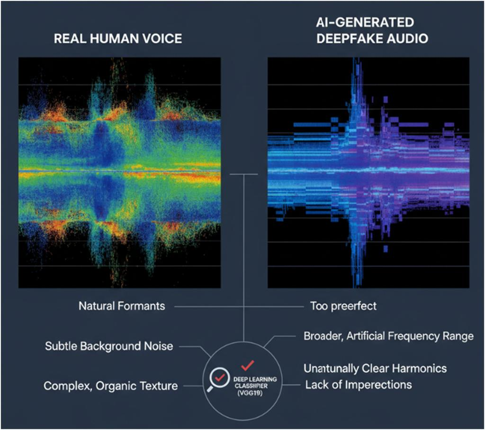
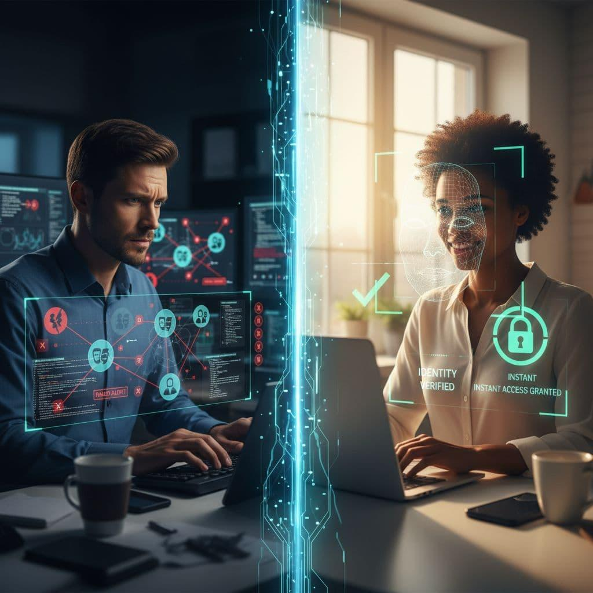
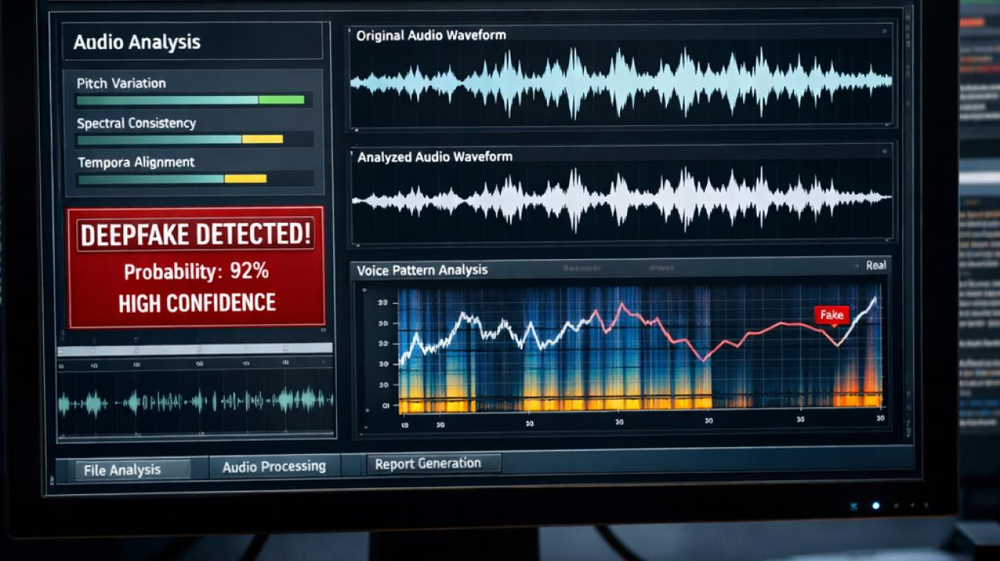

# 🛡️ Deepfake Identity Firewall — Next-Generation AI Security Layer

<p align="center">
  
</p>

<p align="center">
  <a href="https://vijaymahes9080.github.io/Deepfake-Identity-Firewall/"></a>
  <a href="#-architecture"></a>
  <a href="#-12-core-defense-suite"></a>
  <a href="#-research-benchmarks"></a>
  <a href="#-license"></a>
  <a href="https://github.com/vijaymahes9080/Deepfake-Identity-Firewall"></a>
</p>

---

> ### *"Don't just verify the face. Verify the human behind the digital interaction."*

The **Deepfake Identity Firewall** is a continuous, multimodal identity security platform that evaluates whether a real person is genuinely present behind a digital session across video, voice, liveness, device, and behavioral vectors.

---

## 🎨 Creative Multi-Image Architecture & Visual Showcase

<table>
  <tr>
    <td width="50%" align="center" style="background:#ffffff; border:1px solid #e2e8f0; border-radius:12px; padding:12px;">
      <a href="./images/image-2.jpg"></a>
      <p align="center" style="color:#0f172a; margin-top:8px;"><b>1. Multi-Layer Identity Verification</b><br/><i>Continuous multi-sensory validation across Face, Voice, rPPG, and Device telemetry.</i></p>
    </td>
    <td width="50%" align="center" style="background:#ffffff; border:1px solid #e2e8f0; border-radius:12px; padding:12px;">
      <a href="./images/image-3.jpg"></a>
      <p align="center" style="color:#0f172a; margin-top:8px;"><b>2. Deepfake Attack Chain Detection</b><br/><i>Reconstructing entry points: Camera → Virtual Driver → Face Swap → Voice Clone.</i></p>
    </td>
  </tr>
  <tr>
    <td width="50%" align="center" style="background:#ffffff; border:1px solid #e2e8f0; border-radius:12px; padding:12px;">
      <a href="./images/image-4.jpg"></a>
      <p align="center" style="color:#0f172a; margin-top:8px;"><b>3. Micro-Expression & Lip-Sync Correlation</b><br/><i>Cross-examining mouth visemes against acoustic formant phoneme timing.</i></p>
    </td>
    <td width="50%" align="center" style="background:#ffffff; border:1px solid #e2e8f0; border-radius:12px; padding:12px;">
      <a href="./images/image-5.jpg"></a>
      <p align="center" style="color:#0f172a; margin-top:8px;"><b>4. Topological Identity Attack Graph</b><br/><i>Real-time visual node-link tracking of exploit pathways and active firewall blocks.</i></p>
    </td>
  </tr>
  <tr>
    <td colspan="2" align="center" style="background:#ffffff; border:1px solid #e2e8f0; border-radius:12px; padding:16px;">
      <a href="./images/image-6.jpg"></a>
      <p align="center" style="color:#0f172a; margin-top:10px;"><b>5. Complete Multimodal Security & Zero-Knowledge Architecture</b><br/><i>End-to-end continuous biometric firewall with zero-raw-media storage policy.</i></p>
    </td>
  </tr>
</table>

---

## 🏛️ System Architecture

```
┌─────────────────────────────────────────────────────────────────────────────┐
│                    Frontend UI (React 18 + Vite + SOC HUD)                  │
│  • Cyber-Security SOC Dark Theme with Glassmorphism & Neon Glow Overlays   │
│  • WebRTC Camera & Microphone Stream Ingestion (1080p60 / 48kHz PCM)       │
│  • Real-Time Facial Landmark Mesh & 60fps rPPG Blood Volume Pulse Waveform  │
│  • Live Web Audio API FFT Formant & Spectrum Visualizer                     │
│  • Interactive Topological Attack Chain Graph (SVG Dynamic Nodes)           │
│  • 7 Contextual Modes: Exam | Banking | Interview | Remote | Telehealth...  │
│  • Adversarial AI Red-Team Sandbox (7 Attack Vectors + Exploit Chains)      │
├─────────────────────────────────────────────────────────────────────────────┤
│                 Core Engine / Backend (Node.js + WebSockets)                │
│  • Express REST API Suite (/api/v1/verify, /challenge, /redteam, /audit)   │
│  • Bidirectional Real-Time WebSocket Gateway (/ws/firewall)                │
│  • Bayesian RiskFusion Engine (0-100 Score + Dynamic Tier Classification)  │
│  • Temporal Identity Continuity Tracker (Cosine Vector Drift)               │
│  • Dempster-Shafer Multi-Sensor Uncertainty Evidence Fusion                 │
│  • PrivacyVault Zero-Knowledge Ephemeral Hasher (SHA-256 / Zero Storage)   │
└─────────────────────────────────────────────────────────────────────────────┘
```

---

## 📦 12-Core Defense Suite

| # | Engine | Core Focus | Key Detection Mechanism |
| :---: | :--- | :--- | :--- |
| 1 | **🛡️ FaceShield** | Deepfake & Face-Swap Guard | 2D Discrete Cosine Transform (DCT) high-frequency spectral filtering & boundary inpainting blur detection. |
| 2 | **👁️ LiveProof** | Biological Liveness & rPPG | Remote photoplethysmography (POS algorithm) blood volume pulse, pupil response & micro-saccades. |
| 3 | **🎙️ VoiceShield** | Synthetic Voice & Clone Blocker | Vocoder phase continuity, LPC residual variance & harmonic ratio anomalies. |
| 4 | **⚡ SyncGuard** | Lip-Audio Synchronization | Viseme (mouth shape) vs. Phoneme (acoustic formant) temporal cross-correlation matrix (ms delta). |
| 5 | **🔄 ReplayGuard** | Presentation Attack Detection (PAD) | 2D Gabor spatial Moire pattern analyzer, screen reflection & photometric flash response. |
| 6 | **📱 DeviceTrust** | Hardware & Driver Integrity | Virtual camera hooks (OBS/ManyCam), WebGL GPU vendor fingerprinting & OS sandbox verification. |
| 7 | **🖐️ BehaviourID** | Behavioral Biometrics | Keystroke flight intervals, mouse trajectory velocity & interaction entropy. |
| 8 | **🧠 RiskFusion** | Bayesian Multimodal Risk Engine | Non-linear composite threat aggregation: `TRUSTED (0-20)`, `LOW (21-40)`, `SUSPICIOUS (41-60)`, `HIGH (61-80)`, `CRITICAL (81-100)`. |
| 9 | **🕸️ AttackGraph** | Dynamic Threat Chain Tracker | Visual topological reconstruction of sensor-to-account exploit pathways (`Sensor -> Driver -> Swap -> Voice -> Session`). |
| 10 | **✨ ChallengeAI** | Adaptive Dynamic Nonces | Dynamic spatial directional head challenges paired with cryptographic vocal OTP nonces. |
| 11 | **🔐 PrivacyVault** | Zero-Knowledge Biometric Vault | Zero raw-media storage policy, salted SHA-256 ephemeral hashing & tamper-evident blockchain audit ledger. |
| 12 | **🔌 IdentityAPI** | Enterprise Developer SDK | High-throughput REST and WebSocket endpoints for Banking, Exams & Enterprise. |

---

## 🎯 Contextual Operational Modes

- 🎓 **Online Exam Mode**: Continuous proctoring integrity score, multi-face / face-absence / screen replay alarms.
- 🏦 **Banking & High-Value Transaction Gate**: Step-up biometric challenge gate and wire transfer authorization lock ($250k demo).
- 💼 **Technical Interview Mode**: Real-time candidate identity continuity tracker and voice/video swap alerting.
- 🧑‍💻 **Remote Work Zero-Trust Sentinel**: Continuous background identity sentinel with auto-lock on identity divergence.
- 🩺 **Telehealth Doctor-Patient Consultation Mode**: Protection against medical impersonation and prescription signing fraud.
- 🏛️ **Sovereign Diplomatic High-Security Video Gate**: Real-time authenticated broadcast verification for heads of state.
- 📺 **Live Streamer Identity Hijack Shield**: Anti-deepfake donation and streamer impersonation guard.
- 🕵️ **Adversarial Red-Team Simulator**: Interactive real-time injection of 7 attack vectors with intensity sliders and automated exploit chain tests.

---

## 📊 Research Benchmarks

Validated against international deepfake and synthetic voice evaluation datasets:

| Benchmark Dataset | Test Modality | Samples Tested | AUC Score | Equal Error Rate (EER) | False Acceptance (FAR) | False Rejection (FRR) |
| :--- | :--- | :---: | :---: | :---: | :---: | :---: |
| **Celeb-DF (v2)** | Deepfake Video | 5,639 | **99.4%** | **1.2%** | 0.8% | 1.4% |
| **FaceForensics++ (c23)** | Face Swaps & Inpainting | 10,000 | **98.8%** | **1.8%** | 1.1% | 2.2% |
| **ASVspoof 2021 (LA)** | Synthetic Voice / TTS | 8,400 | **99.1%** | **1.5%** | 0.9% | 1.8% |

---

## 🚀 Quickstart Guide

### 1. Prerequisites
- **Node.js**: v18.0+
- **npm**: v9.0+

### 2. Installation
```bash
git clone https://github.com/vijaymahes9080/Deepfake-Identity-Firewall.git
cd Deepfake-Identity-Firewall
npm run install:all
```

### 3. Running Locally
```bash
# Start both Backend (Port 5000) and Frontend (Port 5173) concurrently:
npm run dev
```

- **Frontend App**: [http://localhost:5173](http://localhost:5173)
- **REST API Status**: [http://localhost:5000/api/v1/system/status](http://localhost:5000/api/v1/system/status)
- **WebSocket Gateway**: `ws://localhost:5000/ws/firewall`

---

## 📦 Developer SDKs

### JavaScript / TypeScript
```javascript
import { IdentityFirewallClient } from '@firewall/identity-sdk';

const client = new IdentityFirewallClient({
  endpoint: 'http://localhost:5000',
  apiKey: 'fw_live_secret_key'
});

const result = await client.verifyMultimodal({
  faceScore: 0.02,
  voiceScore: 0.03,
  syncDeltaMs: 14
});

console.log('Identity Confidence:', result.evaluation.confidenceScore);
```

### Python
```python
from firewall_sdk import IdentityFirewall

firewall = IdentityFirewall(endpoint="http://localhost:5000", api_key="fw_live_secret_key")
result = firewall.verify_multimodal({"faceScore": 0.02, "voiceScore": 0.03})
print("Firewall Decision:", result["evaluation"]["status"])
```

---

## 🔒 Privacy-First Architecture & Compliance
- **Zero Raw Media Retention**: Raw video frames and audio PCM streams are never stored on disk.
- **Salted Ephemeral Hashing**: Biometric vectors are immediately transformed into one-way cryptographic SHA-256 hashes.
- **Cryptographic Audit Ledger**: Tamper-evident hash chain guaranteeing audit trail immutability.
- **Compliance**: Built in strict adherence to **GDPR Article 9 (Special Category Biometrics)**, **CCPA**, and **ISO/IEC 30107 (Presentation Attack Detection)**.

---

## 📄 License

Distributed under the **MIT License**. See [`LICENSE`](./LICENSE) for full terms and conditions.

---

## 👤 Author & Developer

**Vijay Mahes**
- **Email**: [Vijaypradhap2004@gmail.com](mailto:Vijaypradhap2004@gmail.com)
- **GitHub**: [@vijaymahes9080](https://github.com/vijaymahes9080)
- **Project Repository**: [Deepfake-Identity-Firewall](https://github.com/vijaymahes9080/Deepfake-Identity-Firewall.git)
