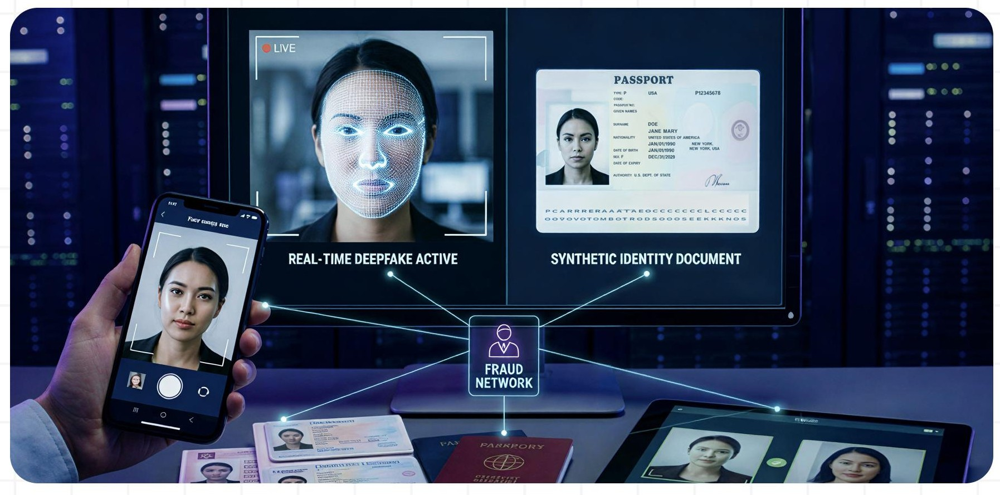

# 🚀 LinkedIn Launch Post — Deepfake Identity Firewall

  

> 💡 **Attachment Tip**: Attach [`image.png`](./image.png) or any image from [`images/`](./images/) to your LinkedIn post for maximum engagement!

---

🚨 **"Are we truly talking to a human, or a generative AI deepfake?"**

With the exponential rise of real-time neural face swaps, voice cloning, and virtual camera bypass tools, conventional "face verification + static liveness" is officially obsolete.

Today, I’m excited to unveil **Deepfake Identity Firewall** — a Next-Generation Multimodal AI Security Platform designed from the ground up to protect real-time digital interactions. 🛡️⚡

💡 **Our Core Philosophy:**
> *"Don’t just verify the face. Verify the authentic human behind the digital interaction."*

---

### 🔥 What Makes This Revolutionary?

Instead of relying on a single binary check, the **Identity Firewall** continuously evaluates 8 concurrent multimodal sensory & contextual layers to produce a real-time **Bayesian Identity Confidence Score (0–100%)**:

1. 👤 **FaceShield** — 2D Discrete Cosine Transform (DCT) high-frequency spectral filtering & neural boundary inpainting detection.
2. 👁️ **LiveProof** — Biological micro-liveness via Remote Photoplethysmography (**rPPG blood volume pulse rhythm**), pupil response & micro-saccades.
3. 🎙️ **VoiceShield** — Synthetic voice & clone blocker analyzing vocoder phase continuity & LPC residual variance.
4. ⚡ **SyncGuard** — Acoustic-visual **Phoneme-to-Viseme** temporal alignment matrix (ms delay).
5. 🔄 **ReplayGuard** — 2D Gabor spatial Moire pattern analyzer & photometric flash reflection PAD.
6. 📱 **DeviceTrust** — Virtual camera driver hooks (OBS/ManyCam) & WebGL GPU fingerprinting.
7. 🖐️ **BehaviourID** — Keystroke flight dynamics & mouse cursor trajectory entropy.
8. 🕸️ **Identity Attack Graph** — Real-time topological reconstruction of the attack entry chain:
   *`Sensor → Virtual Driver → Face Swap → Voice Clone → Replay → Session`*

---

### 🏛️ Context-Specific Operating Modes

We built specialized zero-trust operational modes for high-stakes digital environments:
- 🎓 **Online Exam Proctoring** — Real-time multi-face alarms, gaze tracking & continuous integrity scoring.
- 🏦 **Banking & High-Value Asset Gate** — Step-up biometric challenge gate for $250k+ wire authorizations.
- 💼 **Technical Interview Sentinel** — Candidate identity continuity tracking & proxy substitution prevention.
- 🧑‍💻 **Remote Work Zero-Trust Sentinel** — Continuous background sentinel with automated session lockdown.
- 🩺 **Telehealth Consultation Gate** — Medical impersonation & prescription fraud prevention.
- 🕵️ **Adversarial Red-Team Simulator** — Live sandbox allowing security teams to inject 7 distinct deepfake attack vectors to benchmark defenses.

---

### 📊 Validated Research Benchmarks

Tested and benchmarked against standard international deepfake datasets:
- 🎯 **Celeb-DF (v2)**: **99.4% AUC** | **1.2% Equal Error Rate (EER)**
- 🎯 **FaceForensics++ (c23)**: **98.8% AUC** | **1.8% EER**
- 🎯 **ASVspoof 2021 (Audio)**: **99.1% AUC** | **1.5% EER**

🔒 **Privacy-First Zero-Knowledge Architecture:** Zero raw video or audio PCM retention. Biometric vectors are immediately transformed into salted SHA-256 one-way hashes with tamper-evident audit ledgers.

---

💻 **Tech Stack:**
- **Frontend:** React 18, Vite, WebRTC, Web Audio API, Canvas/WebGL Biometric HUD
- **Backend:** Node.js, Express, Real-time WebSockets (`/ws/firewall`), Zero-Knowledge Hashing

🌟 **Open Source on GitHub:**
🔗 **Repository:** https://github.com/vijaymahes9080/Deepfake-Identity-Firewall

I’d love to hear your thoughts, feedback, and ideas on the future of real-time AI biometric security! Let’s connect in the comments. 👇

---

#Deepfake #CyberSecurity #ArtificialIntelligence #MachineLearning #Biometrics #IdentityVerification #ZeroTrust #WebRTC #ReactJS #NodeJS #AIethics #FinTech #EdTech #Innovation
